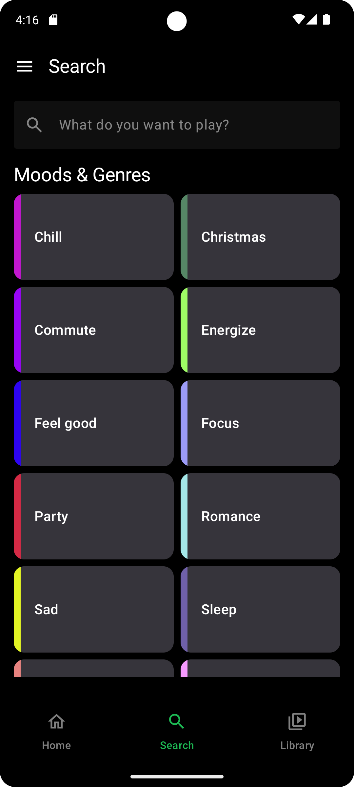
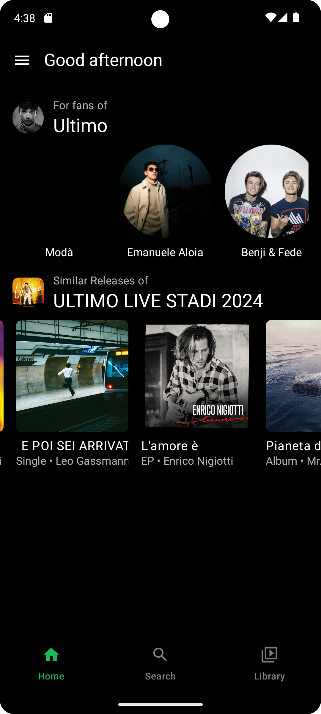
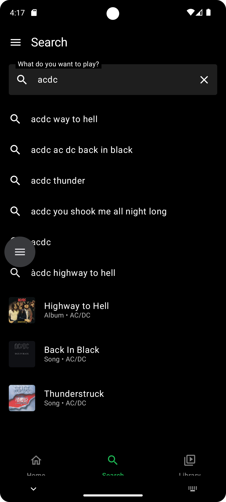
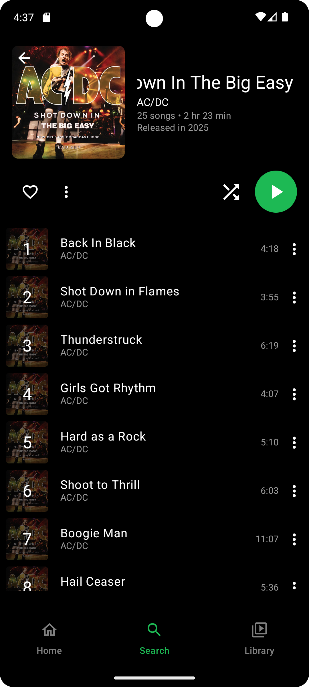
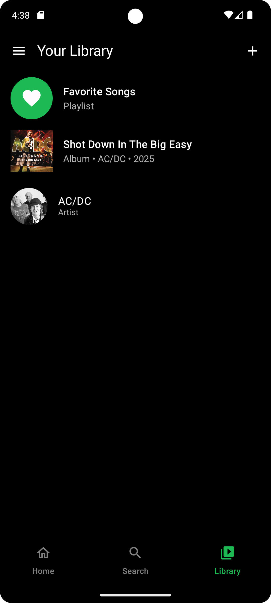
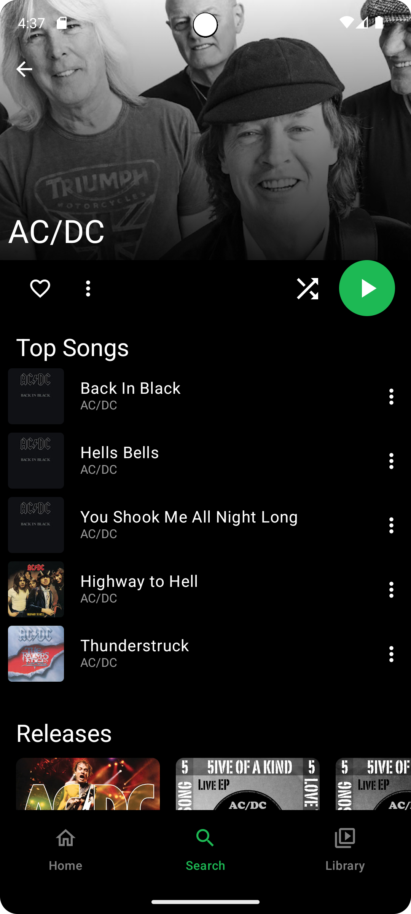
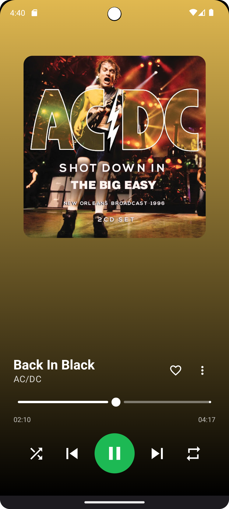

# LibreTune

**Music Player App**

**LibreTune** is a free and open source Music Player app, made in Android.

⠀⠀

## Features

LibreTune is an alternative frontend for YouTube Music, with a focus on user privacy. It includes following features:

- Browse and stream your favorite music
- Search suggestions while typing
- Create playlists
- Save albums, playlists and artists to your library
- Personalized home feed with recommendations
- History of played songs

## Repository layout

This repository hosts both the Android app and the backend service that
powers account features:

- [`mobile/`](./mobile) — the LibreTune Android application (Kotlin / Jetpack
  Compose / Gradle).
- [`backend/`](./backend) — the LibreTune backend, a Django + Django REST
  Framework service deployed at
  [libretune.coluzziandrea.com](https://libretune.coluzziandrea.com) which
  provides user authentication and syncs liked songs, playlists, saved
  albums and saved artists across devices.

## Feature Roadmap

We are actively working on adding more features to LibreTune. Here are some features we are planning to add in the near future:

- Download songs for offline playback
- Queue management, for example, reordering songs in the queue
- Song lyrics search
- Statistics and insights about your listening habits
- Gapless playback
- More audio effects
- Translations
- Android Auto support

## Screenshots

  
  
  
  
  
  
  

## Help & Support

For bug reports and/or feature requests, please create a [GitHub issue](https://github.com/c01ux/libre-tune/issues).

## Disclaimer

This project is for educational and experimental purposes only.

LibreTune is a personal, non-commercial project developed to demonstrate Android development skills, including modern UI with Jetpack Compose, client-server architecture, and local database management.

### No Affiliation

This application is not affiliated with, authorized, maintained, sponsored, or endorsed by YouTube, Google LLC, or any of their affiliates or subsidiaries. This is an independent and unofficial app.

### Copyright and Terms of Service

LibreTune acts as a client that accesses content from third-party services. All content, trademarks, and intellectual property belong to their respective owners. This application does not host or distribute any media content.

Users of this software are solely responsible for their actions and for complying with the terms of service of any third-party platform they access through this app. The developers of LibreTune do not condone copyright infringement or any use of this application that is in violation of third-party terms of service.

### No Warranty

This software is provided "as is", without warranty of any kind, express or implied, including but not limited to the warranties of merchantability, fitness for a particular purpose and noninfringement. In no event shall the authors or copyright holders be liable for any claim, damages or other liability, whether in an action of contract, tort or otherwise, arising from, out of or in connection with the software or the use or other dealings in the software.

## License

LibreTune is Free Software: You can use, study, share, and improve it at will. Specifically you can redistribute and/or modify it under the terms of the [GNU General Public License](https://www.gnu.org/licenses/gpl.html) as published by the Free Software Foundation, either version 3 of the License, or (at your option) any later version.
